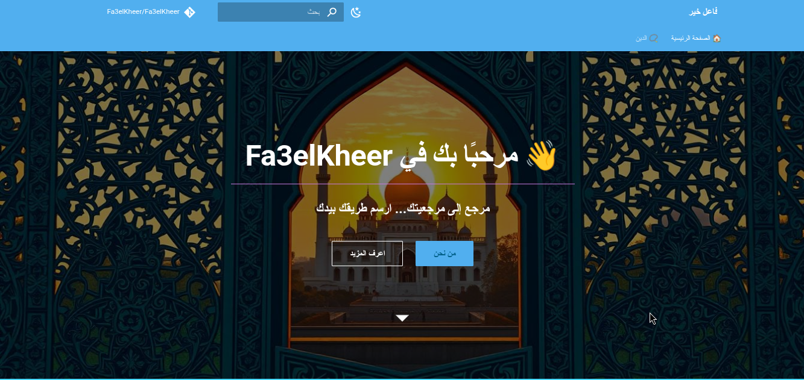

# 📿 Fa3elKheer | فعّل خير

**Fa3elKheer** هو موقع مفتوح المصدر يهدف إلى نشر الخير، والعلم الشرعي، والقيم الإسلامية عبر توثيق شامل ومنظم. يعتمد الموقع على **MkDocs Material** ويجمع بين البساطة والجمالية، لتوفير تجربة قراءة مريحة وملهمة.



---

## ✨ أهداف المشروع

- نشر العلم الشرعي من مصادر موثوقة
- تسهيل الوصول إلى مواضيع مثل: القرآن، الحديث، الفقه، العقيدة، السيرة
- تقديم محتوى منظم وسهل التصفح للمبتدئين والمتخصصين
- دعم قابلية المساهمة من المجتمع لنشر الخير

---

## 📚 الأقسام المتوفرة

- 📖 **القرآن الكريم**: فضائل، تفسير، سور مختارة
- 📜 **الحديث الشريف**: الأربعون النووية، صحيح البخاري
- 📘 **السيرة النبوية**: من المولد إلى الغزوات
- 🧠 **العقيدة**: التوحيد، الأسماء والصفات
- 🌿 **الأخلاق الإسلامية**: الصدق، الأمانة، بر الوالدين
- 🕌 **الفقه**: الصلاة، الصيام، الطهارة، الزكاة، الحج
- 📢 **الدعوة**: آداب وأسس الدعوة إلى الله

---

## 🚀 بدء الاستخدام

```bash
git clone https://github.com/Fa3elKheer/Fa3elKheer.git
cd Fa3elKheer
```

### إنشاء بيئة افتراضية

```bash
python3 -m venv venv
source venv/bin/activate
```

### تثبيت الحزم المطلوبة

```bash
pip install -r requirements.txt
```

### تشغيل الموقع محليًا

```bash
mkdocs serve
```

ثم اذهب إلى: [http://localhost:8000](http://localhost:8000)

---

## 🌐 النشر

```bash
mkdocs gh-deploy
```

تأكد من ضبط إعدادات النشر في `.github/workflows/` إن كنت تستخدم GitHub Actions.

---

## 🙋‍♂️ المساهمون

المشروع مفتوح للمساهمة. شارك في كتابة محتوى، أو تنظيمه، أو تحسين التصميم.

---

## 📜 الرخصة

MIT © 2025 Fa3elKheer Team
